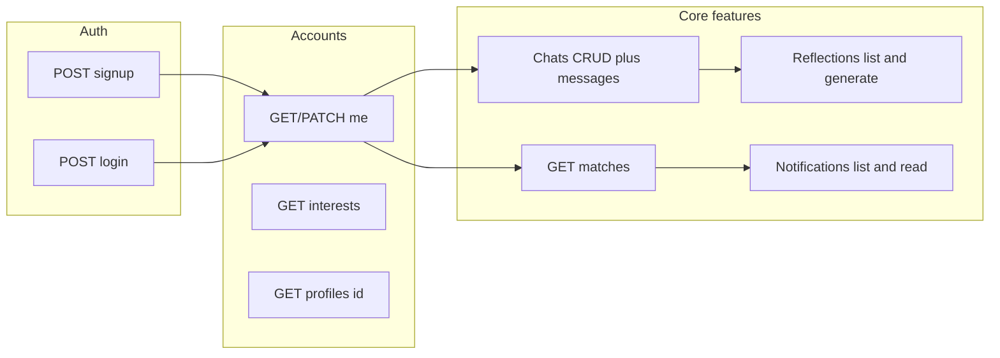

# Energy Match — HTTP API overview

The Django REST API lives under `/api/` on whatever host serves the project. Route wiring is in [`config/urls.py`](config/urls.py). Interactive docs:

- **Swagger** → `/api/docs/`
- **ReDoc** → `/api/redoc/`
- **OpenAPI schema** → `/api/schema/`

The root URL config redirects unknown paths to `/api/docs/`.

---

## Authentication

| Method | Path | Purpose |
|--------|------|--------|
| **POST** | `/api/auth/signup/` | Create user + profile; returns **`token`** so the client can call protected endpoints without a separate login ([`accounts/views.py`](accounts/views.py) — `SignupView`). |
| **POST** | `/api/auth/login/` | Email + password login; returns auth **`token`** ([`config/urls.py`](config/urls.py) — `LoginView` + [`accounts/serializers.py`](accounts/serializers.py) — `EmailAuthTokenSerializer`). |

Protected routes use DRF **`Authorization: Token <key>`** (include the literal word `Token` in the header value where tools expect it).

---

## Accounts and profiles

[`accounts/urls.py`](accounts/urls.py)

| Method | Path | Purpose |
|--------|------|--------|
| **GET** / **PATCH** | `/api/accounts/me/` | Current user’s profile (mood, availability, bio, interests, etc.); PATCH updates profile fields (`MyProfileView` in [`accounts/views.py`](accounts/views.py)). |
| **GET** | `/api/accounts/profiles/<user_id>/` | Read another user’s **public** profile (`ProfileDetailView`). |
| **GET** (list / retrieve) | `/api/accounts/interests/` and `/api/accounts/interests/<id>/` | **Read-only** catalog of interest tags for onboarding/profile (`InterestViewSet`); catalog is maintained in Django admin. |

---

## Matching

[`matching/urls.py`](matching/urls.py)

| Method | Path | Purpose |
|--------|------|--------|
| **GET** | `/api/matches/?limit=10` | **Energy Match**: ranked suggestions for the logged-in user. Score blends **interest similarity** and **mood** ([`matching/views.py`](matching/views.py), [`matching/services.py`](matching/services.py)). **Side effect:** strong matches can create **`new_match`** notifications ([`notifications/services.py`](notifications/services.py)). `limit` is clamped 1–50. |

---

## Chats

[`chats/views.py`](chats/views.py) — `ChatRoomViewSet`; routes under `/api/chats/` (see [`chats/tests.py`](chats/tests.py) for exact URLs).

Backed by Django models `ChatRoom` and `Message` (not Firebase). Only **participants** may access a room.

| Method | Path | Purpose |
|--------|------|--------|
| **GET** | `/api/chats/` | List rooms the user participates in. |
| **POST** | `/api/chats/` | Create a room; caller is auto-added; pass other users in **`participant_ids`**. |
| **GET** | `/api/chats/<room_id>/` | Room detail. |
| **GET** | `/api/chats/<room_id>/messages/` | List messages in the room. |
| **POST** | `/api/chats/<room_id>/messages/` | Send a message; body includes **`content`**. |

---

## Reflections

[`reflections/urls.py`](reflections/urls.py)

| Method | Path | Purpose |
|--------|------|--------|
| **GET** | `/api/reflections/` | List the current user’s saved **conversation reflections** (`ReflectionListView` in [`reflections/views.py`](reflections/views.py)). |
| **POST** | `/api/reflections/rooms/<room_id>/` | **Generate** a reflection for a **Django** `ChatRoom` the user participates in (same VADER pipeline). |
| **POST** | `/api/reflections/from-transcript/` | **Generate** from an arbitrary message list (e.g. **Firebase RTDB** export). Body: `{ "messages": [ { "content": "…", "sender": "…" } ] }` (limits enforced). Persists `Reflection` with **`room` null** (`FromTranscriptReflectionView`). |

---

## Notifications

[`notifications/urls.py`](notifications/urls.py)

| Method | Path | Purpose |
|--------|------|--------|
| **GET** | `/api/notifications/?unread=1` | List notifications for the user; **`unread=1`** (or `true`) filters to unread only. |
| **POST** | `/api/notifications/<pk>/read/` | Mark one notification read. |
| **POST** | `/api/notifications/read-all/` | Mark all unread read; response includes **`marked_read`** count. |

---

## Related docs

- Product flow: [`USER_FLOW.md`](USER_FLOW.md)
- Run locally: [`SETUP.md`](SETUP.md)

The **ConnectVibe-main** mobile app in this repo is largely **Firebase**-based; this backend is optional HTTP integration for matching, REST chats, reflections, and notifications if you point the client at the same `BASE_URL` used here.
